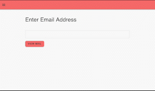
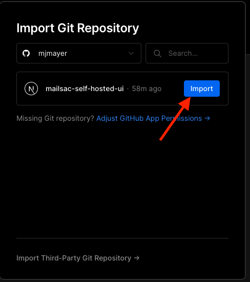
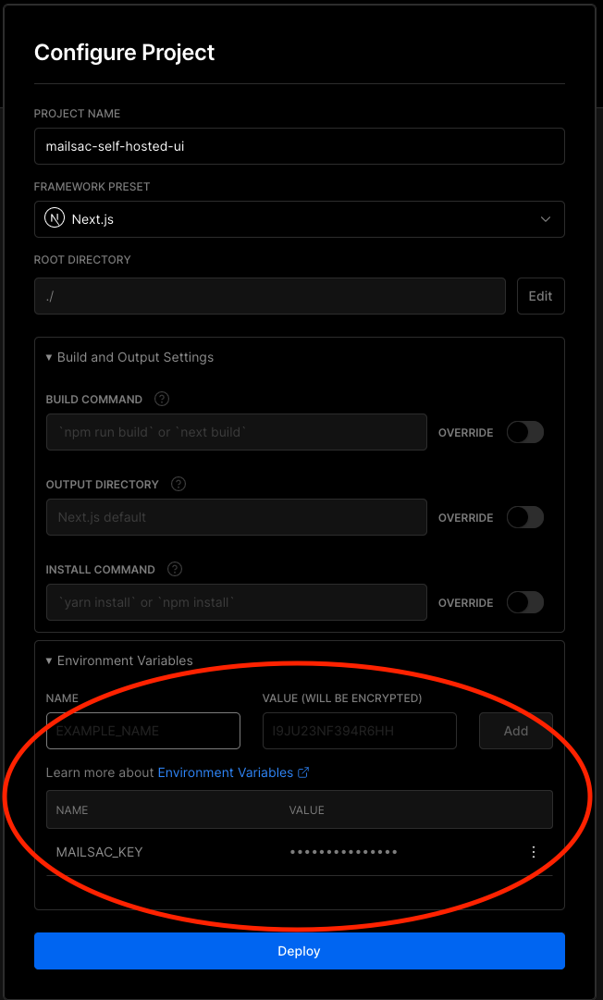
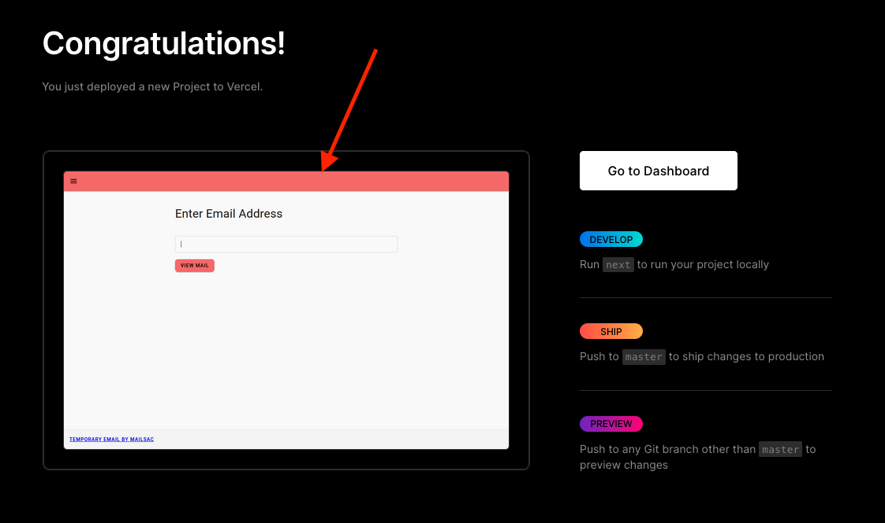

# Mailsac Self-Hosted Temporary Email User Interface

This project is a user interface for disposable email. It uses mailsac.com as the backend mail service.



## Use Cases

[Mailsac](https://mailsac.com) already offers disposable email without a need to sign up for an account. What need does
this application meet that Mailsac doesn't already provide?

Mailsac has limitations on what can be viewed without signing up for an account. Only the latest email in a public
mailbox can be viewed withing an account. Mail in a private domain cannot be viewed without signing in with an account
that has permissions to the private domain.

### Class Room Use Case

An instructor may want students, who are young in age and don't have an email address, to sign up for an account with
a web service used in the class. The Mailsac Self-Hosted Temporary Email User Interface application provides a
simplified interface for students to view email sent to a private mailsac hosted domain without the need to sign up for
a mailsac account or email address.

### Acceptance Tester Use Case

As part of the sofware development lifecycle there is a need to have software tested by users. Temporary email has long
been beneficial to testing. The Mailsac Self-Hosted Temporary Email User Interface makes this easier. Users can test
applications using email addresses in a Mailsac hosted private domain without the need to sign up for a Mailsac account.
Furthermore, because the application is self-hosted companies can use a reverse proxy to enforce IP allow lists or put
the application behind basic authentication.

## Running the Mailsac Self-Hosted Email User Interface

### Local

With [NodeJS](https://nodejs.org/en/) installed this application can be run with the following commands.


```bash
npm install && npm run build
MAILSAC_KEY=YOUR_MAILSAC_API_KEY npm run start
```

You will need to generate a Mailsac API key. To generate or manage API Keys use the
[API Keys page](https://mailsac.com/api-keys).

The application is now running and can be accessed via a web browser at http://localhost:3000 .

Any public or private Mailsac hosted address the API key has access to can be viewed by entering the email address in the
text box and selecting "view mail".


#### Domain Option

You can prepopulate the domain by using the `NEXT_PUBLIC_MAILSAC_CUSTOM_DOMAIN` environment variable.

```bash
NEXT_PUBLIC_MAILSAC_CUSTOM_DOMAIN=example.mailsac.com npm run build
MAILSAC_KEY=YOUR_MAILSAC_API_KEY npm run start
```


### Vercel Hosted

Vercel is a platform as a service provider. Their service makes running your own Next.js application easy.

The Vercel [Getting Started](https://vercel.com/docs/get-started) guide is easy to follow.

1. Fork this repo.
2. Sign up for a [Vercel account](https://vercel.com)
3. Grant Vercel permissions to read all your repos or choose to grant permission on the forked repo
4. Import forked repository into Vercel \
   

5. Configure `MAILSAC_KEY` environment variable \
   

6. Deploy application \
   

After a successful deployment you can click on the image of the application  to be taken to the live application.

**NOTE** There is currently no authentication on this application. Anyone with the URL will be able to view emails
and domains associated with the Mailsac API key that was used.

You are free to deploy this app however you like. Please keep the attribution to Mailsac.

## License

See the LICENSE file at the root of this repository.

MIT LICENSE

Copyright © 2022 Forking Software LLC <support@team.mailsac.com>
